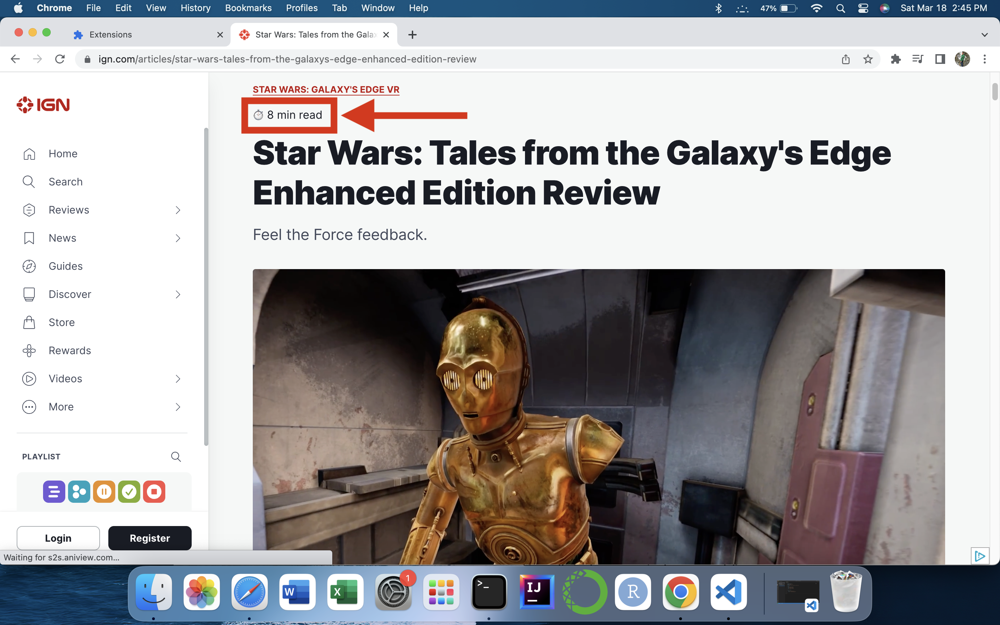
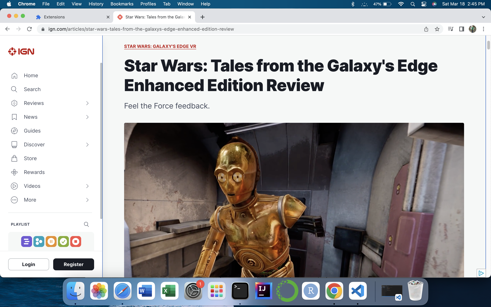

# IGNReadingTime

A google chrome extension that displays the expected reading time for an IGN article at the op of the article.

Example of an IGN article with the extension:

Example of an IGN article without the extension:
